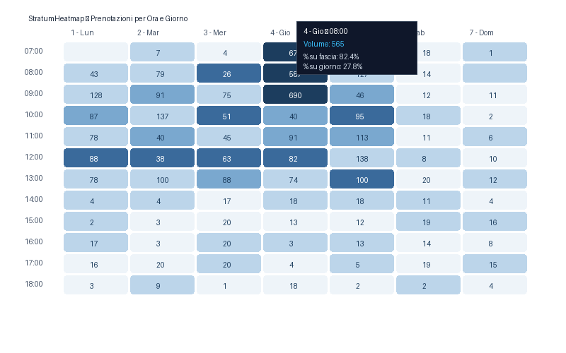
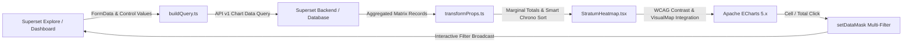

# StratumHeatmap - Interactive Matrix Grid & Density Heatmap for Apache Superset

[](https://opensource.org/licenses/Apache-2.0)
[](https://superset.apache.org/)
[](https://www.typescriptlang.org/)
[](https://echarts.apache.org/)
[](#)

**StratumHeatmap** is an enterprise-grade, high-performance visualization plugin for **Apache Superset** engineered for deep two-dimensional matrix analysis of volume, intensity, and density distributions (e.g., **Day of Week $\times$ Hour of Day** for healthcare demand planning, call center workload optimization, and operational capacity management).

---

## 📸 Visual Preview



*Figure 1: StratumHeatmap interactive matrix displaying weekly booking density with marginal row/column totals, smart chronological sorting, and dynamic contrast text.*

---

## 🌟 Key Features

### 1. ⚡ High-Performance Apache ECharts Engine
- **Hardware-Accelerated 2D Canvas**: Fluid 60 fps rendering with responsive dimension tracking via `ResizeObserver`.
- **Customizable Geometry**: Configurable cell corner radius (`cellRadius`), cell border widths, and crisp separator lines.
- **Adaptive In-Cell Labels**: Displays formatted numeric values directly inside cells with intelligent font scaling to prevent clipping.

### 2. 🎚️ Dual-Mode VisualMap (Continuous Slider vs. Discrete Piecewise)
- **Continuous Gradient Slider**: Interactive min/max range handle allowing dashboard users to filter visual intensity on the fly.
- **Discrete Piecewise Legend**: Categorized intensity buckets with interactive toggles to isolate high-density outliers or low-volume periods.

### 3. 🔄 Native Superset Cross-Filtering (`emit_filter`)
- Full support for `Behavior.InteractiveChart` and `setDataMask`.
- **Coordinate Cell Filtering**: Clicking any matrix cell (e.g., *Thursday at 08:00 AM*) immediately dispatches coordinated filters on both the X-axis and Y-axis dimensions across companion dashboard charts.
- **Marginal Total Cross-Filtering**:
 - Clicking a **Row Total** filters exclusively for that row across all columns.
 - Clicking a **Column Total** filters exclusively for that column across all rows.
 - Clicking the **Grand Total** clears or resets active filters.

### 4. 📊 Integrated Marginal Totals (Row, Column & Grand Totals)
- **Distinct Visual Styling**: Dedicated summary rows and columns formatted with neutral backgrounds and reinforced borders to preserve heatmap visual contrast.
- **Configurable Aggregations**: Compute summary statistics via either **Sum** or **Average** modes.
- **Customizable Labels**: Full localization support for header labels (e.g., `Total`, `Average`, `Totale`).

### 5. 👁️ Automated WCAG 2.1 Contrast Calculation
- **Real-Time Relative Luminance**: Evaluates RGB values of each computed cell color at runtime.
- **Intelligent Text Inversion**: Automatically flips cell text between pure white and dark navy based on background brightness, guaranteeing WCAG 2.1 AA legibility across all gradient steps.

### 6. 📅 Intelligent Chronological Sorter (`smartSort`)
- Automatically detects day-of-week names in both English and Italian (`Monday`..`Sunday`, `Mon`..`Sun`, `1 - Lunedì`..`7 - Domenica`) and 24-hour time slots (`00:00`..`23:00`).
- Orders axes chronologically without requiring auxiliary sorting columns or database query workarounds.

### 7. 💡 Multidimensional Rich HTML Tooltips
- On hover, tooltips present:
 - Exact `[X × Y]` matrix coordinates.
 - Absolute metric value formatted according to locale preferences.
 - `% of Row Total` contribution.
 - `% of Column Total` contribution.
 - `% of Grand Total` contribution.

---

## 🏛️ Architecture Overview



---

## 📁 Repository Structure

```
superset-plugin-chart-stratum-heatmap/
├── package.json                    # Plugin manifest & dependencies
├── tsconfig.json                   # TypeScript build settings
├── install.bat                     # Windows batch installer launcher
├── scripts/
│   ├── installer_gui.py            # Graphical desktop installer (Tkinter)
│   ├── install.js                  # Cross-platform zero-dependency Node.js installer
│   ├── install.ps1                 # Windows PowerShell automated installer
│   ├── installer.py                # Python command-line installer
│   └── generate_thumbnails.py      # Asset generator for chart picker previews
├── src/
│   ├── index.ts                    # Plugin export entry point
│   ├── types.ts                    # TypeScript definitions
│   ├── plugin/
│   │   ├── index.ts                # ChartPlugin registration & metadata
│   │   ├── buildQuery.ts           # Query constructor for /api/v1/chart/data
│   │   ├── controlPanel.tsx        # Superset Explore form controls
│   │   └── transformProps.ts       # Coordinate mapping, totals & percentage calculations
│   ├── components/
│   │   └── StratumHeatmap.tsx      # Main React component wrapping ECharts
│   ├── utils/
│   │   ├── contrast.ts             # WCAG luminance and text color inversion
│   │   ├── sorters.ts              # Smart chronological date/hour sorter
│   │   └── formatting.ts           # Metric and percentage string formatters
│   └── images/
│       ├── thumbnail.png           # Chart picker light thumbnail
│       ├── thumbnail-dark.png      # Chart picker dark thumbnail
│       └── example.png             # High-resolution gallery preview
```

---

## 🚀 Quick Installation in Apache Superset

The plugin features an automated installer suite capable of auto-discovering Apache Superset locations (e.g. `D:\Sviluppo\superset`, sibling directories, or user home):

### Option 1: Desktop GUI Installer (Recommended for Windows)
Double-click:
👉 **`install.bat`**  
Or run:
```bash
python scripts/installer_gui.py
```
A desktop interface appears with Superset path auto-detection, a directory browser, Webpack cache cleaning toggles, and live progress logging.

### Option 2: Zero-Dependency Node.js Installer (Cross-Platform)
```bash
# Auto-detect Superset path:
node scripts/install.js

# Or pass path explicitly:
node scripts/install.js "D:\Sviluppo\superset"
```

### Option 3: PowerShell Script
```powershell
powershell -ExecutionPolicy Bypass -File scripts/install.ps1 -SupersetPath "D:\Sviluppo\superset"
```

### Option 4: Python CLI
```bash
python scripts/installer.py --superset-path "D:\Sviluppo\superset"
```

Each installer automatically:
1. Validates and installs missing npm dependencies.
2. Compiles TypeScript sources (`npm run build`).
3. Syncs assets into `superset-frontend/plugins/superset-plugin-chart-stratum-heatmap`.
4. Idempotently registers `StratumHeatmapPlugin` in `MainPreset.ts`.
5. Clears Webpack and Babel compilation caches.

---

## 🐳 Docker Compose Integration

Once installed into your Superset repository:

### Standard / Non-Dev Mode (Production / Staging)
```bash
cd /path/to/superset
docker compose -f docker-compose-non-dev.yml up -d --build superset
```

### Frontend Development Mode (Hot Reloading)
```bash
cd /path/to/superset
docker compose restart superset-node
```

Visit `http://localhost:8088`, create a new chart, and pick **StratumHeatmap** from the gallery!

---

## 🛠️ Explore Control Panel Reference

| Section | Control | Type | Description |
|:---|:---|:---|:---|
| **Query Configuration** | `X-Axis Dimension` | Select | Column for the horizontal matrix axis (e.g., `Day of Week`). |
| | `Y-Axis Dimension` | Select | Column for the vertical matrix axis (e.g., `Hour of Day`). |
| | `Metric / Cell Value` | Metric | Quantitative metric measuring cell intensity (e.g., `Booking Volume`). |
| **Color & Palette** | `Color Palette` | Select | Color scheme: `wavesOfBlue` (Corporate), `supersetColors`, `emeraldHeat`, etc. |
| | `Invert Color Palette` | Checkbox | Reverses color ramp direction. |
| | `VisualMap Type` | Select | Legend mode: `continuous` (gradient slider) or `piecewise` (discrete intervals). |
| **Cell Formatting** | `Show Cell Values` | Checkbox | Renders numeric values directly inside matrix cells. |
| | `Cell Border Radius` | Slider | Corner rounding in pixels (0px to 8px). |
| | `Cell Border Width` | Slider | Border thickness separating matrix cells. |
| **Marginal Totals** | `Show Row Totals` | Checkbox | Displays marginal summary column at the right edge of the grid. |
| | `Show Column Totals` | Checkbox | Displays marginal summary row at the bottom edge of the grid. |
| | `Totals Aggregation` | Select | Aggregation method for marginal summaries (`sum` or `average`). |
| | `Totals Label` | Text | Custom heading for summary rows and columns (default: `Total`). |
| **Sorting & Display** | `Enable Smart Sort` | Checkbox | Chronologically sorts day names and 24-hour timestamps automatically. |
| | `Emit Cross-Filters` | Checkbox | Enables multi-dimension `setDataMask` cross-filtering on cell click. |

---

## 🧪 Development & Testing

```bash
# Install dependencies
npm install

# Compile TypeScript
npm run build

# Watch mode for iterative development
npm run dev
```

---

## 📄 License

Distributed under the **Apache License 2.0**.
